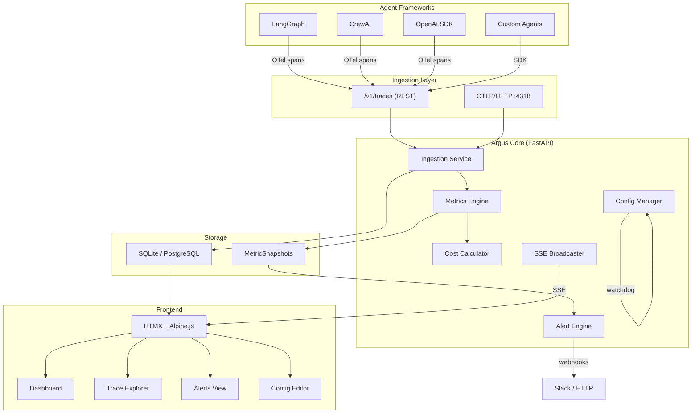
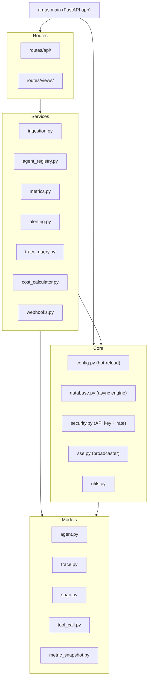
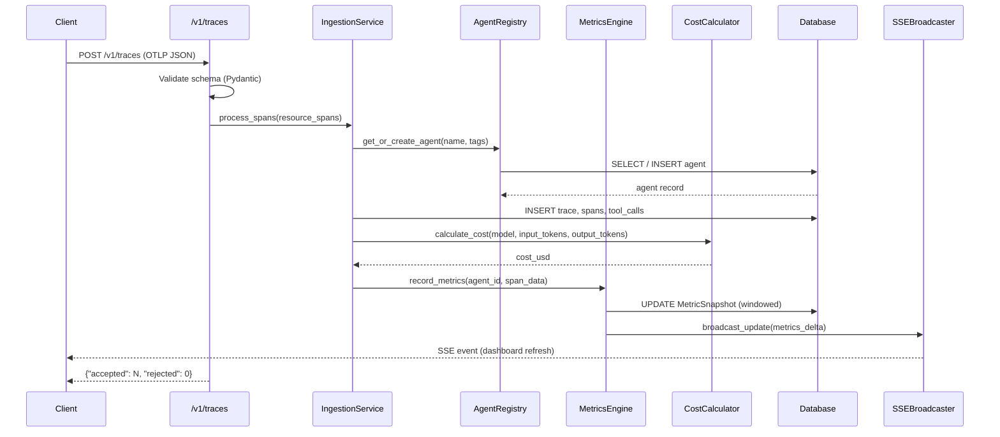
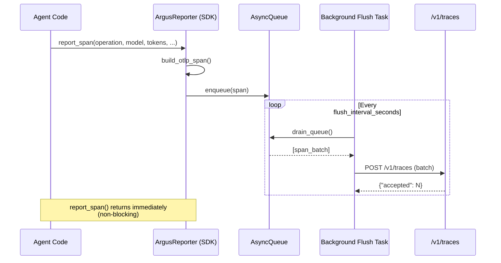
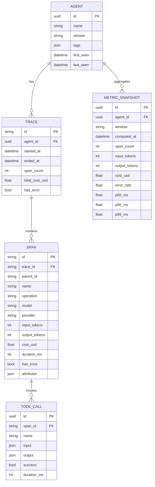
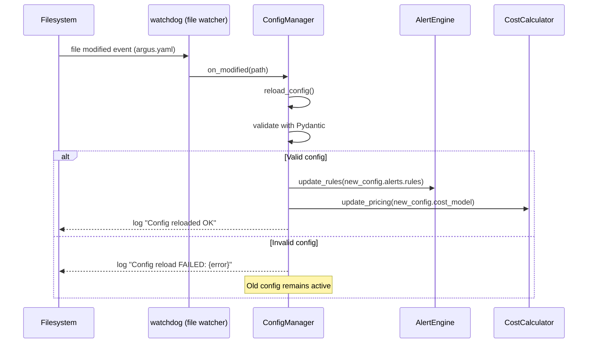

## System Overview

Argus Panoptes is structured as a layered FastAPI application. Agent frameworks
emit OpenTelemetry spans, which are ingested, stored, aggregated, and surfaced
through both a REST API and a real-time HTMX frontend.

---

## Component Hierarchy

---

## Data Flow: Span Ingestion

---

## Data Flow: STDIO Ingestion (SDK)

---

## Entity-Relationship Diagram

---

## Configuration Hot-Reload

---

## Tech Stack

| Layer | Technology | Purpose |
|-------|-----------|---------|
| Backend framework | FastAPI | Async HTTP, dependency injection, OpenAPI |
| ORM / Models | SQLModel + SQLAlchemy async | Type-safe DB access, migrations |
| Database | SQLite (dev) / PostgreSQL (prod) | Persistent storage |
| Validation | Pydantic v2 | Request/response schemas, config |
| Real-time | Server-Sent Events | Live dashboard updates |
| Config reload | watchdog | File-system event monitoring |
| Frontend | HTMX 2.x + Alpine.js 3.x | Reactive UI without a JS build step |
| Styling | Tailwind CSS 4.x | Utility-first CSS |
| Migrations | Alembic | Schema evolution for SQLite + PostgreSQL |
| Container | Docker multi-stage | Minimal image, non-root user |
| CI | GitHub Actions | Lint, type check, security scan, tests |

---

## Design Principles

1. **API routes return JSON, view routes return HTML.** Never mix them. This keeps
   the REST API clean and independently usable.

2. **HTMX targets fragments.** Each `hx-get` targets a route that returns exactly
   the HTML partial it needs to swap. No full-page reloads.

3. **Hot-reload is foundational.** The `ConfigManager` watches `argus.yaml` with
   watchdog. Invalid YAML is rejected, the old config stays active.

4. **Dual database support.** All SQL uses SQLAlchemy Core / SQLModel — no raw
   SQL. Alembic uses `render_as_batch=True` for SQLite `ALTER TABLE` compatibility.

5. **Type everything.** All function signatures have type hints. mypy strict mode
   is enforced in CI.

6. **Cost is always calculated server-side.** Clients never send cost — Argus
   always derives cost from token counts and the config-driven pricing table.
